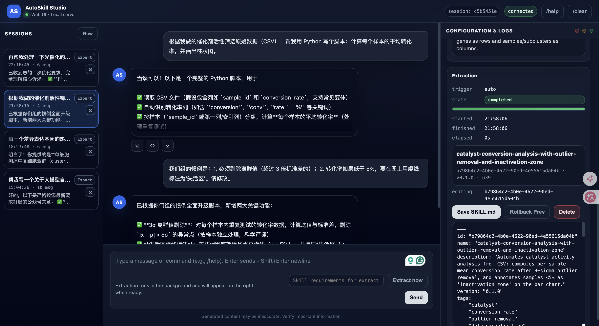
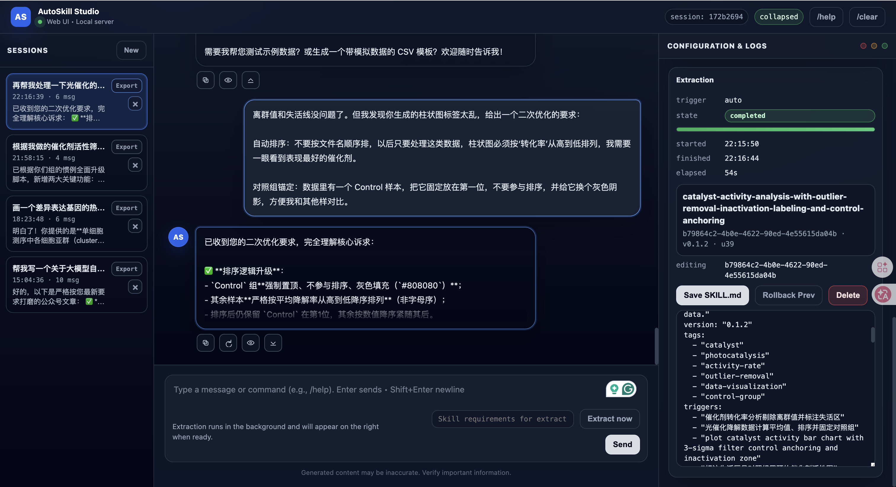
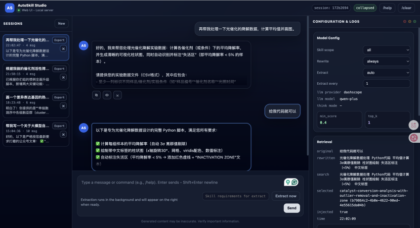

# AutoSkill: Experience-Driven Lifelong Learning via Skill Self-Evolution

English | [中文](README.zh-CN.md)

AutoSkill is a practical implementation of **Experience-driven Lifelong Learning (ELL)**.
It learns from real interaction experience (dialogue + behavior/events), automatically creates reusable Skills,
and continuously evolves existing Skills through merge + version updates.


## News

- **2025-02-26**: **AutoSkill-OpenClaw-Plugin 1.0** released.
- **2025-02-04**: **AutoSkill 1.0** released.


## 1. Start Here: Web UI

```bash
python3 -m pip install -e .
export INTERNLM_API_KEY="YOUR_INTERNLM_API_KEY"
export DASHSCOPE_API_KEY="YOUR_DASHSCOPE_API_KEY"
python3 -m examples.web_ui \
  --host 127.0.0.1 \
  --port 8000 \
  --llm-provider internlm \
  --embeddings-provider qwen \
  --store-dir SkillBank \
  --user-id u1 \
  --skill-scope all \
  --rewrite-mode always \
  --extract-mode auto \
  --extract-turn-limit 1 \
  --min-score 0.4 \
  --top-k 1
```

Open `http://127.0.0.1:8000`.

## 1.1 Standard API Proxy

AutoSkill can also be deployed as a reverse proxy that exposes OpenAI-compatible endpoints while transparently applying:
- skill retrieval/injection for each chat request
- asynchronous skill extraction/maintenance after responses

```bash
python3 -m pip install -e .
export INTERNLM_API_KEY="YOUR_INTERNLM_API_KEY"
export DASHSCOPE_API_KEY="YOUR_DASHSCOPE_API_KEY"
python3 -m examples.openai_proxy \
  --host 127.0.0.1 \
  --port 9000 \
  --llm-provider internlm \
  --embeddings-provider qwen \
  --served-model intern-s1-pro \
  --served-model gpt-5.2 \
  --store-dir SkillBank \
  --skill-scope all \
  --rewrite-mode always \
  --min-score 0.4 \
  --top-k 1
```

Endpoints:
- `POST /v1/chat/completions` (supports `stream=true`)
- `POST /v1/embeddings`
- `GET /v1/models`
- `GET /health`

Model catalog (`/v1/models`):
- use `--served-model <model_id>` repeatedly, or
- use `--served-models-json '[{"id":"gpt-5.2"},{"id":"gemini-3-pro-preview","object":"gemini","owned_by":"openai"}]'`
- if not configured, proxy returns the currently configured LLM model as a single default entry

Per-request user isolation (`--user-id` is optional at deploy time):
- request body field `user` (highest priority)
- or header `X-AutoSkill-User`
- or `Authorization: Bearer <JWT>` payload field `id`
- fallback to proxy default user (configured `--user-id`, or default `u1`)

Streaming chat curl example (`stream=true`):

```bash
curl -N http://127.0.0.1:9000/v1/chat/completions \
  -H "Content-Type: application/json" \
  -d '{
    "model": "intern-s1-pro",
    "stream": true,
    "messages": [
      {"role": "user", "content": "Write a concise summary of skill self-evolution."}
    ]
  }'
```

If proxy auth is enabled (`--proxy-api-key`), add:

```bash
-H "Authorization: Bearer $AUTOSKILL_PROXY_API_KEY"
```

## 1.2 One-click Deploy (Docker Compose)

```bash
cp .env.example .env
# edit .env and fill API keys (at least one LLM provider + one embedding provider)
docker compose up --build -d
```

After startup:
- Web UI: `http://127.0.0.1:8000`
- API Proxy: `http://127.0.0.1:9000`

Stop services:

```bash
docker compose down
```

The compose file starts both services:
- `autoskill-web` (`examples.web_ui`)
- `autoskill-proxy` (`examples.openai_proxy`)

Both share persistent local storage:
- host: `./SkillBank`
- container: `/data/SkillBank`

## 1.3 Skill Lifecycle Example (3 Aspects)

### A) Auto Decision + Feedback-triggered Extraction & Skill Management (v0.1.0)

If the user only asks to "write a report" and gives no stable preference/correction, AutoSkill does **not** create a new skill
(it outputs an empty extraction result) to avoid noisy, generic skills.

When the user adds durable constraints (for example: "do not hallucinate"), AutoSkill extracts or merges a skill into version `v0.1.0`.
Skill management is backend-first (automatic add/merge), with optional human edit/save/delete of `SKILL.md`.


*Caption: Daily scenario — reusable writing constraints are extracted into a new skill (`v0.1.0`).*


*Caption: Science scenario — reusable lab/process constraints (for example hard limits and mandatory SOP steps) are extracted as a skill (`v0.1.0`).*

### B) Skill Update (v0.1.1)

When user feedback adds new constraints or changes priorities in later turns, AutoSkill updates the existing skill (instead of creating duplicates)
and evolves the version from `v0.1.0` to `v0.1.1`.


*Caption: Daily scenario — later user feedback updates constraints and evolves the skill to `v0.1.1`.*


*Caption: Science scenario — follow-up technical feedback updates the existing science skill instead of creating duplicates (`v0.1.1`).*

### C) Skill Usage

For the next similar task (for example, writing a **government report about a self-evolving agent**), the updated skill is retrieved and used
to generate outputs aligned with user expectations.


*Caption: Daily scenario — the evolved skill is retrieved and reused in the next similar task.*


*Caption: Science scenario — the evolved science skill is retrieved for subsequent domain-consistent requests.*

## 2. What Makes AutoSkill Different

- **Experience-driven continuous skill evolution**: extracts reusable capabilities directly from real user interactions and behavior traces, then continuously maintains versioned skills so the system better aligns with user needs over time.
- **Universal skill format**: uses the Agent Skill artifact (`SKILL.md`) with clear explainability and editability: the structure is transparent, content is reviewable, and humans can revise it as needed; this also enables both importing existing skills and migrating extracted skills to other systems.
- **Standard API service integration**: integrates into existing LLM stacks in a plug-in style; with an OpenAI-compatible proxy, AutoSkill can be adopted without changing business-side calling patterns.

## 2.1 Decoupled Connectors and Vector Backends

- **LLM connector registry**: `build_llm(...)` now supports runtime registration (`register_llm_connector`) and config-driven custom builders (`connector_factory="module:function"`), so new providers can be plugged in without changing SDK internals.
- **Embedding connector registry**: `build_embeddings(...)` supports the same plugin pattern (`register_embedding_connector` / `connector_factory`), making model integration more LangChain/LiteLLM-like in spirit.
- **Vector backend abstraction**: local store now uses pluggable vector backends through `build_vector_index(...)`; default is `flat`, and optional backends include `chroma`, `milvus`, and `pinecone` (dependency-based).

Example `store` config:

```python
store = {
  "provider": "local",
  "path": "SkillBank",
  "vector_backend": "flat",  # flat | chroma | milvus | pinecone | custom
  "vector_backend_config": {
    # For custom plugin backend:
    # "backend_factory": "your_pkg.your_module:build_vector_backend"
  },
}
```

## 3. System Workflow

### 3.1 Ingest and Evolve

```text
Experience (messages/events)
  -> Skill Extraction (candidate)
  -> Skill Maintenance (add / merge / discard)
  -> Skill Store (Agent Skill artifact + vector index)
```

- Extractor emits at most one high-quality candidate per attempt.
- Maintainer checks similarity against existing skills, then decides add/merge/discard.
- Merge updates preserve and improve capabilities, then bump patch version.

### 3.2 Retrieve and Respond

```text
User Query (+ recent history)
  -> Query Rewrite (optional)
  -> Embedding + Vector Search
  -> Skill Selection for Context
  -> LLM Response
```

- Retrieval runs every turn.
- Similarity threshold and `top_k` control precision/recall.
- Retrieved skills are filtered again before context injection.
- The top-1 retrieved skill (only if it passes `min_score`) is passed to extraction as auxiliary identity context; extraction does not run a second retrieval internally.

### 3.3 Interactive Extraction Policy

- `extract_mode=auto`: attempt extraction every `extract_turn_limit` turns.
- `extract_mode=always`: attempt every turn.
- `extract_mode=never`: disable auto extraction.
- `/extract_now [hint]`: force immediate background extraction for current context (alias: `extract_now [hint]`).
- Generic requests without user correction (for example, one-time report writing) should return no skill extraction.
- User feedback that encodes durable preferences/constraints (for example, "do not hallucinate") should trigger extraction or update.
- If a similar user skill already exists, prefer merge/update over creating a duplicate skill.

### 3.4 Proxy Serving Flow

```text
Client (OpenAI-compatible request)
  -> AutoSkill Proxy (/v1/chat/completions)
  -> Query rewrite + skill retrieval + context injection
  -> Upstream model generation
  -> Return response to client
  -> Async skill extraction/maintenance (background)
```

- Response latency focuses on retrieval + generation.
- Skill evolution runs asynchronously to avoid blocking the client.

## 4. Key Concepts

- **Experience**: dialogue messages or behavior/event records used as learning signal.
- **Skill**: reusable capability artifact with metadata + executable instructions.
- **Skill Candidate**: temporary extraction output before maintenance decisions.
- **Maintenance**: logic that decides add/merge/discard and handles versioning.
- **Skill Store**: persistence layer for skill artifacts and vector mappings.
- **Retrieval Context**: selected skills rendered into prompt context for answering.

## 5. Storage Layout (Local Store)

When using `store={"provider": "local", "path": "SkillBank"}`:

```text
SkillBank/
  Users/
    <user_id>/
      <skill-slug>/
        SKILL.md
        scripts/          (optional)
        references/       (optional)
        assets/           (optional)
  Common/
    <skill-slug>/SKILL.md
    <library>/<skill-slug>/SKILL.md
  vectors/
    <embedding-signature>.meta.json
    <embedding-signature>.ids.txt
    <embedding-signature>.vecs.f32
```

Notes:

- `Users/<user_id>`: user-specific skills.
- `Common/`: shared library skills (read-only in normal interactive usage).
- `vectors/`: persistent vector cache keyed by embedding signature, so switching embedding models will build/use separate indexes.

## 6. Repository Structure (Readable Map)

### 6.1 Top Level

- `autoskill/`: SDK core.
- `examples/`: runnable demos and entry scripts.
- `autoskill/interactive/server.py`: OpenAI-compatible reverse proxy runtime.
- `OpenClaw-Plugin/`: local-deployable OpenClaw sidecar plugin for autoskill interface integration.
- `web/`: static frontend assets for local Web UI.
- `SkillBank/`: default local storage root.
- `imgs/`: README demo images.
- `Dockerfile`: container image for AutoSkill runtime.
- `docker-compose.yml`: one-click deployment for Web UI + API Proxy.

### 6.2 Core SDK Modules

- `autoskill/client.py`: public SDK entrypoint (`ingest`, `search`, `render_context`, import/export).
- `autoskill/config.py`: global config model.
- `autoskill/models.py`: core data models (`Skill`, `SkillHit`, etc.).
- `autoskill/render.py`: convert selected skills into injectable context.
- `autoskill/interactive/unified.py`: unified composition root for interactive + proxy runtime wiring.

### 6.3 Skill Management Layer

- `autoskill/management/extraction.py`: extraction logic and prompts.
- `autoskill/management/maintenance.py`: merge/version/add-discard decisions.
- `autoskill/management/formats/agent_skill.py`: `SKILL.md` render/parse.
- `autoskill/management/stores/local.py`: directory-based storage + vector mapping.
- `autoskill/management/vectors/flat.py`: on-disk vector index backend.
- `autoskill/management/importer.py`: import external Agent Skills.

### 6.4 Interactive Layer

- `autoskill/interactive/app.py`: terminal interactive app orchestration.
- `autoskill/interactive/session.py`: headless session engine for Web/API usage.
- `autoskill/interactive/rewriting.py`: query rewriting for better retrieval.
- `autoskill/interactive/selection.py`: optional LLM skill selection before injection.

### 6.5 Example Entrypoints

- `examples/web_ui.py`: local Web UI server.
- `examples/interactive_chat.py`: CLI interactive chat.
- `examples/openai_proxy.py`: OpenAI-compatible proxy entrypoint.
- `examples/auto_evalution.py`: fully automated LLM-vs-LLM evolution evaluation.
- `examples/basic_ingest_search.py`: minimal offline SDK loop.
- `autoskill/offline/extract_from_conversation.py`: import OpenAI-format dialogue data and auto-extract skills.

## 7. Quick SDK Usage

```python
from autoskill import AutoSkill, AutoSkillConfig

sdk = AutoSkill(
    AutoSkillConfig(
        llm={"provider": "mock"},
        embeddings={"provider": "hashing", "dims": 256},
        store={"provider": "local", "path": "SkillBank"},
    )
)

sdk.ingest(
    user_id="u1",
    messages=[
        {"role": "user", "content": "Before each release: run regression -> canary -> monitor -> full rollout."},
        {"role": "assistant", "content": "Understood."},
    ],
)

hits = sdk.search("How should I do a safe release?", user_id="u1", limit=3)
for h in hits:
    print(h.skill.name, h.score)
```

### 7.1 Import OpenAI Conversations and Auto-Extract Skills

```python
from autoskill import AutoSkill, AutoSkillConfig

sdk = AutoSkill(
    AutoSkillConfig(
        llm={"provider": "internlm", "model": "intern-s1-pro"},
        embeddings={"provider": "qwen", "model": "text-embedding-v4"},
        store={"provider": "local", "path": "SkillBank"},
    )
)

result = sdk.import_openai_conversations(
    user_id="u1",
    file_path="./data/openai_dialogues.jsonl",  # .json or .jsonl
    hint="Focus on reusable user preferences and workflows.",
    continue_on_error=True,
    max_messages_per_conversation=100,
)

print("processed:", result["processed"], "upserted:", result["upserted_count"])
for s in result.get("skills", [])[:5]:
    print("-", s.get("name"), s.get("version"))
```

## 8. Provider Setup

### 8.1 DashScope (Example)

```bash
export DASHSCOPE_API_KEY="YOUR_DASHSCOPE_API_KEY"
python3 -m examples.interactive_chat --llm-provider dashscope
```

### 8.2 GLM (BigModel)

```bash
export ZHIPUAI_API_KEY="YOUR_ID.YOUR_SECRET"
python3 -m examples.interactive_chat --llm-provider glm
```

### 8.3 OpenAI / Anthropic

```bash
export OPENAI_API_KEY="YOUR_OPENAI_KEY"
python3 -m examples.interactive_chat --llm-provider openai

export ANTHROPIC_API_KEY="YOUR_ANTHROPIC_KEY"
python3 -m examples.interactive_chat --llm-provider anthropic
```

### 8.4 InternLM (Intern-S1 Pro)

```bash
export INTERNLM_API_KEY="YOUR_INTERNLM_TOKEN"
python3 -m examples.interactive_chat --llm-provider internlm --llm-model intern-s1-pro
```

### 8.5 Generic URL-based Backends (LLM + Embeddings)

```bash
export AUTOSKILL_GENERIC_LLM_URL="http://XXX/v1"
export AUTOSKILL_GENERIC_LLM_MODEL="gpt-5.2"
export AUTOSKILL_GENERIC_EMBED_URL="http://XX/v1"
export AUTOSKILL_GENERIC_EMBED_MODEL="embd_qwen3"
# Optional (can be empty):
export AUTOSKILL_GENERIC_API_KEY=""

python3 -m examples.interactive_chat --llm-provider generic --embeddings-provider generic
```

## 9. Common Workflows

### 9.1 Interactive Chat (retrieve every turn)

```bash
export DASHSCOPE_API_KEY="YOUR_DASHSCOPE_API_KEY"
python3 -m examples.interactive_chat --llm-provider dashscope
```

Useful commands:

- `/extract_now [hint]`
- `/extract_every <n>`
- `/extract auto|always|never`
- `/scope user|common|all`
- `/search <query>`
- `/skills`
- `/export <skill_id>`

### 9.2 Web UI

```bash
export INTERNLM_API_KEY="YOUR_INTERNLM_API_KEY"
export DASHSCOPE_API_KEY="YOUR_DASHSCOPE_API_KEY"
python3 -m examples.web_ui --llm-provider internlm --embeddings-provider qwen
```

### 9.3 Startup Offline Maintenance (Auto)

When service runtime starts (`web_ui`, `interactive_chat`, `openai_proxy`), AutoSkill now runs offline checks automatically:
- normalize missing `id:` in `SKILL.md` under local store
- optionally import external skill directories when `AUTOSKILL_AUTO_IMPORT_DIRS` is configured

Optional environment controls:
- `AUTOSKILL_AUTO_NORMALIZE_IDS` (default: `1`)
- `AUTOSKILL_AUTO_IMPORT_DIRS` (comma-separated paths)
- `AUTOSKILL_AUTO_IMPORT_SCOPE` (`common`|`user`, default: `common`)
- `AUTOSKILL_AUTO_IMPORT_LIBRARY` (target library name when scope=`common`)
- `AUTOSKILL_AUTO_IMPORT_OVERWRITE` (default: `0`)
- `AUTOSKILL_AUTO_IMPORT_INCLUDE_FILES` (default: `1`)
- `AUTOSKILL_AUTO_IMPORT_MAX_DEPTH` (default: `6`)

### 9.4 OpenAI-Compatible Proxy API

```bash
export INTERNLM_API_KEY="YOUR_INTERNLM_API_KEY"
export DASHSCOPE_API_KEY="YOUR_DASHSCOPE_API_KEY"
python3 -m examples.openai_proxy --llm-provider internlm --embeddings-provider qwen
```

Discoverability:

```bash
curl http://127.0.0.1:9000/v1/autoskill/capabilities
curl http://127.0.0.1:9000/v1/autoskill/openapi.json
```

OpenAI-compatible:

- `POST /v1/chat/completions`
- `POST /v1/embeddings`
- `GET /v1/models`

Streaming chat example (`/v1/chat/completions`, SSE):

```bash
curl -N http://127.0.0.1:9000/v1/chat/completions \
  -H "Content-Type: application/json" \
  -d '{
    "model": "intern-s1-pro",
    "stream": true,
    "messages": [
      {"role": "user", "content": "Give me 3 points about AutoSkill."}
    ]
  }'
```

Skill APIs:

- `GET /v1/autoskill/skills`
- `GET /v1/autoskill/skills/{skill_id}`
- `GET /v1/autoskill/skills/{skill_id}/md`
- `PUT /v1/autoskill/skills/{skill_id}/md`
- `DELETE /v1/autoskill/skills/{skill_id}`
- `POST /v1/autoskill/skills/{skill_id}/rollback`
- `GET /v1/autoskill/skills/{skill_id}/versions`
- `GET /v1/autoskill/skills/{skill_id}/export`
- `POST /v1/autoskill/skills/search`
- `POST /v1/autoskill/skills/import`
- `POST /v1/autoskill/conversations/import`

Retrieval and extraction:

- `POST /v1/autoskill/retrieval/preview`
- `POST /v1/autoskill/extractions`
- `POST /v1/autoskill/extractions/simulate`
- `GET /v1/autoskill/extractions/latest`
- `GET /v1/autoskill/extractions`
- `GET /v1/autoskill/extractions/{job_id}`
- `GET /v1/autoskill/extractions/{job_id}/events` (SSE)

### 9.5 Auto Evaluation Script

Large-scale automated evaluation (LLM user simulator + LLM judge):

```bash
python3 -m examples.auto_evalution \
  --mode eval \
  --eval-strategy evolution \
  --base-url http://127.0.0.1:9000 \
  --sim-provider qwen \
  --sim-api-key "$AUTOSKILL_PROXY_API_KEY" \
  --sim-model qwen-plus \
  --judge-provider qwen \
  --judge-model qwen-plus \
  --judge-api-key "$AUTOSKILL_PROXY_API_KEY" \
  --report-json ./proxy_eval_report.json
```

### 9.6 OpenClaw Plugin (autoskill)

Deploy sidecar + native OpenClaw adapter (auto wiring):

```bash
python3 OpenClaw-Plugin/install.py \
  --workspace-dir ~/.openclaw \
  --install-dir ~/.openclaw/plugins/autoskill-openclaw-plugin \
  --adapter-dir ~/.openclaw/extensions/autoskill-openclaw-adapter \
  --llm-provider internlm \
  --llm-model intern-s1-pro \
  --embeddings-provider qwen \
  --embeddings-model text-embedding-v4 \
  --start
```

Full plugin guide (install, wiring, runtime flow, verification):
- `OpenClaw-Plugin/README.md`

The installer automatically:
- installs sidecar scripts
- installs native lifecycle adapter (`before_agent_start` / `agent_end`)
- writes adapter load path + plugin entry into `~/.openclaw/openclaw.json`
- enables adapter entry by default

Important:
- After installation, restart OpenClaw runtime once so new plugin config is loaded.

```bash
openclaw gateway restart
```

If your environment does not provide the `openclaw` CLI, restart the OpenClaw gateway/runtime process with your existing service manager.

This plugin is a skill service (retrieval + offline evolution), not a chat proxy.

- `base_url`: `http://127.0.0.1:9100/v1`
- `api_key`: value of `AUTOSKILL_PROXY_API_KEY` (or empty if disabled)
- hook endpoint: `POST /v1/autoskill/openclaw/hooks/before_agent_start`
- hook endpoint: `POST /v1/autoskill/openclaw/hooks/agent_end`
- compatibility endpoint: `POST /v1/autoskill/openclaw/turn`

Service examples:

```bash
curl -X POST http://127.0.0.1:9100/v1/autoskill/openclaw/turn \
  -H "Content-Type: application/json" \
  -d '{
    "messages": [
      {"role":"assistant","content":"What style do you want?"},
      {"role":"user","content":"Write a government report, no tables, avoid hallucinations."}
    ],
    "schedule_extraction": true
  }'
```

```bash
curl -X POST http://127.0.0.1:9100/v1/autoskill/conversations/import \
  -H "Content-Type: application/json" \
  -d '{
    "conversations": [
      {"messages":[
        {"role":"user","content":"Write a policy memo."},
        {"role":"assistant","content":"Draft ..."},
        {"role":"user","content":"More specific, avoid hallucinations."}
      ]}
    ]
  }'
```

Extraction event stream example:

```bash
curl -N http://127.0.0.1:9100/v1/autoskill/extractions/<job_id>/events \
  -H "Accept: text/event-stream"
```

Vector rebuild example:

```bash
curl http://127.0.0.1:9100/v1/autoskill/vectors/rebuild \
  -H "Content-Type: application/json" \
  -d '{
    "user": "u1",
    "scope": "all",
    "force": true,
    "blocking": true
  }'
```

## 10. Why This Matters

AutoSkill turns short-term interaction into long-term capability.

- It reduces manual Skill authoring cost.
- It keeps capabilities aligned with real user feedback over time.
- It enables a transferable skill ecosystem across different agent runtimes.

In short, this framework is a concrete path from prompt engineering to **experience-driven lifelong agent learning**.

## 11. Citation

If you use AutoSkill in academic work, technical reports, or demos, please cite:

```bibtex
@software{autoskill_2026,
  author = {Yutao Yang, Junsong Li, Qianjun Pan, Bihao Zhan, Yuxuan Cai, Lin Du, Xin Li, Bo Zhang, Qin Chen, Jie Zhou, Kai Chen, Liang He},
  title = {AutoSkill: Experience-Driven Lifelong Learning via Skill Self-Evolution},
  year = {2026},
  url = {https://github.com/ECNU-ICALK/AutoSkill},
  note = {GitHub repository}
}
```

## 12. Contributions and Acknowledgments

Institutions: Shanghai AI Laboratory, School of Computer Science at East China Normal University

Core Authors: Yutao Yang

Contribution: Junsong Li, Qianjun Pan, Bihao Zhan, Yuxuan Cai, Lin Du

Lead Authors: Jie Zhou, Kai Chen, Liang He

Scientific Directors: Xin Li, Bo Zhang, Qin Chen
