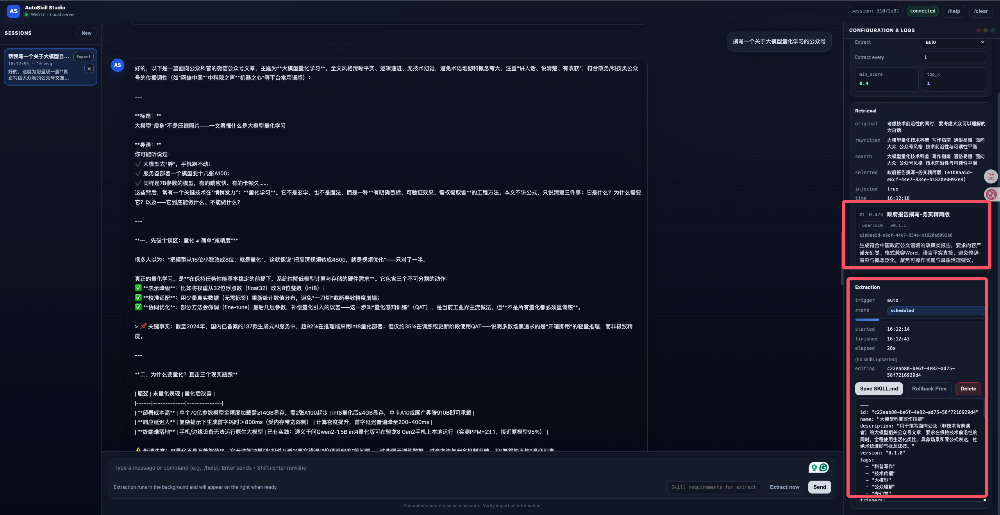
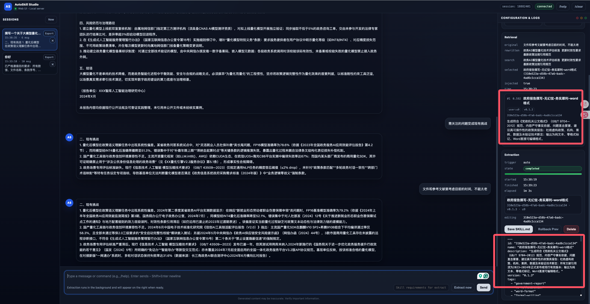
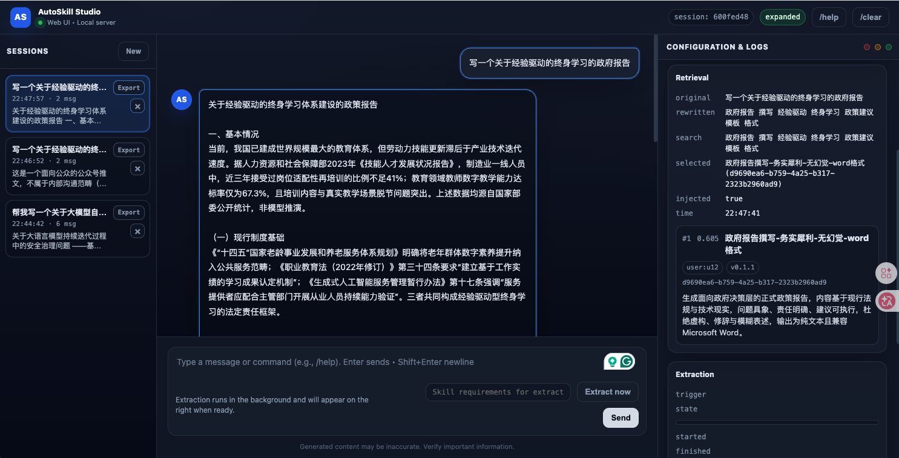

# AutoSkill: 基于技能自进化的经验驱动终身学习

中文 | [English](README.md)

AutoSkill 是 **Experience-driven Lifelong Learning（ELL，经验驱动终身学习）** 的工程化实践。
它从真实交互经验（对话 + 行为/事件）中学习，自动生成可复用技能，并通过合并与版本演进持续优化已有技能。


## 1. 快速开始：Web UI

```bash
python3 -m pip install -e .
export INTERNLM_API_KEY="YOUR_INTERNLM_API_KEY"
export DASHSCOPE_API_KEY="YOUR_DASHSCOPE_API_KEY"
python3 -m examples.web_ui \
  --host 127.0.0.1 \
  --port 8000 \
  --llm-provider internlm \
  --embeddings-provider qwen \
  --store-dir Skills \
  --user-id u1 \
  --skill-scope all \
  --rewrite-mode always \
  --extract-mode auto \
  --extract-turn-limit 1 \
  --min-score 0.4 \
  --top-k 1
```

启动后打开 `http://127.0.0.1:8000`。

## 1.1 标准 API 代理

AutoSkill 也可以作为反向代理部署，对外暴露 OpenAI 兼容接口，并在内部自动执行：
- 每次对话请求的技能检索与注入
- 回答后的异步技能抽取与维护

```bash
python3 -m pip install -e .
export INTERNLM_API_KEY="YOUR_INTERNLM_API_KEY"
export DASHSCOPE_API_KEY="YOUR_DASHSCOPE_API_KEY"
python3 -m examples.openai_proxy \
  --host 127.0.0.1 \
  --port 9000 \
  --llm-provider internlm \
  --embeddings-provider qwen \
  --store-dir Skills \
  --user-id u1 \
  --skill-scope all \
  --rewrite-mode always \
  --min-score 0.4 \
  --top-k 1
```

支持接口：
- `POST /v1/chat/completions`（支持 `stream=true`）
- `POST /v1/embeddings`
- `GET /v1/models`
- `GET /health`

按请求隔离用户：
- 请求体字段 `user`（推荐）
- 或请求头 `X-AutoSkill-User`

流式聊天调用示例（`stream=true`）：

```bash
curl -N http://127.0.0.1:9000/v1/chat/completions \
  -H "Content-Type: application/json" \
  -d '{
    "model": "intern-s1-pro",
    "user": "u1",
    "stream": true,
    "messages": [
      {"role": "user", "content": "请简要总结技能自进化的核心思路。"}
    ]
  }'
```

如果启用了代理鉴权（`--proxy-api-key`），请额外添加：

```bash
-H "Authorization: Bearer $AUTOSKILL_PROXY_API_KEY"
```

## 1.2 技能生命周期示例（三个方面）

### A) 自动判断 + 反馈触发抽取与技能管理（v0.1.0）

如果用户只是提出“写一份报告”这类通用一次性请求，且没有给出稳定偏好或纠偏反馈，
AutoSkill 会默认不新增技能（抽取结果为空），避免产生噪声技能。

当用户给出可复用的稳定约束（例如“不要幻觉”）时，AutoSkill 会触发抽取或与已有技能合并，形成 `v0.1.0`。
技能管理以后端自动为主（自动新增/合并），并支持人工编辑保存或删除 `SKILL.md`。



### B) 技能更新（v0.1.1）

后续交互中当用户继续给出新增约束或偏好变化时，AutoSkill 会优先更新已有技能而不是产生重复技能，
将版本从 `v0.1.0` 演进到 `v0.1.1`。



### C) 技能使用

当再次出现类似任务（例如撰写一份**自进化智能体的政府报告**）时，系统会检索并使用该技能，
输出更贴合用户需求的结果。



## 2. 项目核心特点

- **经验驱动技能持续进化**：直接从真实用户交互和行为轨迹中抽取可复用能力，并持续进行版本演进与维护，让系统越用越贴合用户需求。
- **通用技能格式**：采用 Agent Skill 形态（`SKILL.md`），具备可解释、可编辑的优势：结构清晰、内容可审阅、可按需人工修改；既可导入已有技能，也可将抽取技能迁移到其他系统。
- **标准接口服务化**：以可插拔方式接入现有大模型；通过 OpenAI 兼容代理，可在不改业务调用形态的情况下接入 AutoSkill。

## 3. 系统工作流

### 3.1 学习与进化流程

```text
经验数据（messages/events）
  -> 技能抽取（candidate）
  -> 技能维护（add / merge / discard）
  -> 技能存储（Agent Skill + 向量索引）
```

- 每次尝试最多产出一个高质量候选技能。
- 维护阶段先做相似匹配，再决定新增/合并/丢弃。
- 合并后自动递增 patch 版本，形成长期演化轨迹。

### 3.2 检索与回答流程

```text
当前 Query（含最近上下文）
  -> Query 重写（可选）
  -> 向量化 + 向量检索
  -> 技能选择与注入
  -> 大模型回答
```

- 检索每轮执行。
- 通过相似度阈值与 `top_k` 控制召回质量。
- 检索后仍可二次筛选，避免无关技能注入。
- 检索 Top-1 技能（需通过 `min_score`）会作为抽取阶段的辅助身份参考输入；抽取内部不再二次检索。

### 3.3 交互抽取策略

- `extract_mode=auto`：每 `extract_turn_limit` 轮尝试抽取。
- `extract_mode=always`：每轮都尝试抽取。
- `extract_mode=never`：关闭自动抽取。
- `/extract_now [hint]`：对当前上下文立即发起后台抽取（别名：`extract_now [hint]`）。
- 对“仅完成一次通用任务且无用户纠偏”的场景（如一次性写报告），应返回不抽取。
- 当用户反馈形成稳定可复用约束（如“不要幻觉”）时，触发抽取或更新。
- 若已有相似用户技能，优先合并更新，而非新建重复技能。

### 3.4 代理服务流程

```text
客户端（OpenAI 兼容请求）
  -> AutoSkill Proxy (/v1/chat/completions)
  -> Query 重写 + 技能检索 + 上下文注入
  -> 上游模型生成
  -> 返回响应给客户端
  -> 异步技能抽取/维护（后台）
```

- 响应时延重点在检索与生成。
- 技能进化异步执行，避免阻塞客户端响应。

## 4. 核心概念

- **Experience**：对话消息或行为事件，是学习信号源。
- **Skill**：可复用能力制品，包含元数据与可执行指令。
- **Skill Candidate**：抽取阶段的临时候选，尚未进入长期库。
- **Maintenance**：新增/合并/丢弃决策与版本管理。
- **Skill Store**：技能制品与向量映射的持久化层。
- **Retrieval Context**：被选中的技能上下文，注入回答链路。

## 5. 本地存储结构（Local Store）

当使用 `store={"provider": "local", "path": "Skills"}`：

```text
Skills/
  Users/
    <user_id>/
      <skill-slug>/
        SKILL.md
        scripts/          (可选)
        references/       (可选)
        assets/           (可选)
  Common/
    <skill-slug>/SKILL.md
    <library>/<skill-slug>/SKILL.md
  vectors/
    <embedding-signature>.meta.json
    <embedding-signature>.ids.txt
    <embedding-signature>.vecs.f32
```

说明：

- `Users/<user_id>`：用户私有技能。
- `Common/`：共享技能库（通常只读）。
- `vectors/`：按 embedding 签名分开的持久化向量缓存，切换 embedding 模型后不会混用旧索引。

## 6. 仓库结构（更易读版本）

### 6.1 顶层目录

- `autoskill/`：SDK 核心实现。
- `examples/`：可直接运行的示例入口。
- `autoskill/proxy/`：OpenAI 兼容反向代理运行时。
- `web/`：本地 Web UI 静态资源。
- `Skills/`：默认本地技能存储根目录。
- `imgs/`：README 示例图片。

### 6.2 SDK 核心模块

- `autoskill/client.py`：SDK 对外入口（`ingest/search/render/import/export`）。
- `autoskill/config.py`：全局配置模型。
- `autoskill/models.py`：核心数据结构（`Skill`、`SkillHit` 等）。
- `autoskill/render.py`：技能上下文渲染。

### 6.3 Skill Management 层

- `autoskill/skill_management/extraction.py`：技能抽取逻辑与提示词。
- `autoskill/skill_management/maintenance.py`：新增/合并/丢弃和版本演化。
- `autoskill/skill_management/formats/agent_skill.py`：`SKILL.md` 渲染与解析。
- `autoskill/skill_management/stores/local.py`：目录存储与向量映射。
- `autoskill/skill_management/vectors/flat.py`：本地向量索引后端。
- `autoskill/skill_management/importer.py`：导入外部 Agent Skills。

### 6.4 Interactive 层

- `autoskill/interactive/app.py`：CLI 交互编排。
- `autoskill/interactive/session.py`：Web/API 可复用会话引擎。
- `autoskill/interactive/rewriting.py`：检索 query 重写。
- `autoskill/interactive/selection.py`：注入前技能选择。

### 6.5 示例入口

- `examples/web_ui.py`：本地 Web UI 服务。
- `examples/interactive_chat.py`：终端交互式对话。
- `examples/openai_proxy.py`：OpenAI 兼容代理启动入口。
- `examples/proxy_health_check.py`：代理端点与流式健康检查。
- `examples/import_agent_skills.py`：导入已有技能。
- `examples/normalize_skill_ids.py`：补齐/规范化技能 ID。
- `examples/dashscope_qwen_chat.py`：百炼聊天 API 示例。
- `examples/dashscope_qwen_embeddings.py`：百炼向量 API 示例。
- `examples/bigmodel_glm_embed_extract.py`：GLM + 向量在线抽取示例。
- `examples/bigmodel_glm_persistent_store.py`：GLM + 本地持久化示例。
- `examples/basic_ingest_search.py`：离线最小 SDK 流程示例。
- `examples/local_persistent_store.py`：离线本地持久化示例。

## 7. SDK 最小使用示例

```python
from autoskill import AutoSkill, AutoSkillConfig

sdk = AutoSkill(
    AutoSkillConfig(
        llm={"provider": "mock"},
        embeddings={"provider": "hashing", "dims": 256},
        store={"provider": "local", "path": "Skills"},
    )
)

sdk.ingest(
    user_id="u1",
    messages=[
        {"role": "user", "content": "Before each release: run regression -> canary -> monitor -> full rollout."},
        {"role": "assistant", "content": "Understood."},
    ],
)

hits = sdk.search("How should I do a safe release?", user_id="u1", limit=3)
for h in hits:
    print(h.skill.name, h.score)
```

## 8. Provider 配置建议

### 8.1 百炼 DashScope（示例）

```bash
export DASHSCOPE_API_KEY="YOUR_DASHSCOPE_API_KEY"
python3 -m examples.interactive_chat --llm-provider dashscope
```

### 8.2 GLM（BigModel）

```bash
export ZHIPUAI_API_KEY="YOUR_ID.YOUR_SECRET"
python3 -m examples.interactive_chat --llm-provider glm
```

### 8.3 OpenAI / Anthropic

```bash
export OPENAI_API_KEY="YOUR_OPENAI_KEY"
python3 -m examples.interactive_chat --llm-provider openai

export ANTHROPIC_API_KEY="YOUR_ANTHROPIC_KEY"
python3 -m examples.interactive_chat --llm-provider anthropic
```

### 8.4 InternLM（Intern-S1 Pro）

```bash
export INTERNLM_API_KEY="YOUR_INTERNLM_TOKEN"
python3 -m examples.interactive_chat --llm-provider internlm --llm-model intern-s1-pro
```

## 9. 常用工作流

### 9.1 终端交互（每轮检索）

```bash
export DASHSCOPE_API_KEY="YOUR_DASHSCOPE_API_KEY"
python3 -m examples.interactive_chat --llm-provider dashscope
```

常用命令：

- `/extract_now [hint]`
- `/extract_every <n>`
- `/extract auto|always|never`
- `/scope user|common|all`
- `/search <query>`
- `/skills`
- `/export <skill_id>`

### 9.2 Web UI

```bash
export INTERNLM_API_KEY="YOUR_INTERNLM_API_KEY"
export DASHSCOPE_API_KEY="YOUR_DASHSCOPE_API_KEY"
python3 -m examples.web_ui --llm-provider internlm --embeddings-provider qwen
```

### 9.3 导入已有 Agent Skills

```bash
python3 -m examples.import_agent_skills --root-dir /path/to/skills --scope common --store-dir Skills
```

### 9.4 规范化缺失的技能 ID

```bash
python3 -m examples.normalize_skill_ids --store-dir Skills
```

### 9.5 OpenAI 兼容代理 API

```bash
export INTERNLM_API_KEY="YOUR_INTERNLM_API_KEY"
export DASHSCOPE_API_KEY="YOUR_DASHSCOPE_API_KEY"
python3 -m examples.openai_proxy --llm-provider internlm --embeddings-provider qwen
```

能力发现：

```bash
curl http://127.0.0.1:9000/v1/autoskill/capabilities
curl http://127.0.0.1:9000/v1/autoskill/openapi.json
```

OpenAI 兼容端点：

- `POST /v1/chat/completions`
- `POST /v1/embeddings`
- `GET /v1/models`

流式聊天示例（`/v1/chat/completions`，SSE）：

```bash
curl -N http://127.0.0.1:9000/v1/chat/completions \
  -H "Content-Type: application/json" \
  -d '{
    "model": "intern-s1-pro",
    "user": "u1",
    "stream": true,
    "messages": [
      {"role": "user", "content": "请给出 AutoSkill 的 3 点价值。"}
    ]
  }'
```

技能管理端点：

- `GET /v1/autoskill/skills`
- `GET /v1/autoskill/skills/{skill_id}`
- `GET /v1/autoskill/skills/{skill_id}/md`
- `PUT /v1/autoskill/skills/{skill_id}/md`
- `DELETE /v1/autoskill/skills/{skill_id}`
- `POST /v1/autoskill/skills/{skill_id}/rollback`
- `GET /v1/autoskill/skills/{skill_id}/versions`
- `GET /v1/autoskill/skills/{skill_id}/export`
- `POST /v1/autoskill/skills/search`
- `POST /v1/autoskill/skills/import`

检索与抽取端点：

- `POST /v1/autoskill/retrieval/preview`
- `POST /v1/autoskill/extractions`
- `POST /v1/autoskill/extractions/simulate`
- `GET /v1/autoskill/extractions/latest`
- `GET /v1/autoskill/extractions`
- `GET /v1/autoskill/extractions/{job_id}`
- `GET /v1/autoskill/extractions/{job_id}/events`（SSE）

### 9.6 代理健康检查脚本

```bash
python3 -m examples.proxy_health_check --mode health --base-url http://127.0.0.1:9000
```

大规模自动化评测（代理作为助手 + 可选 Qwen 用户模拟）：

```bash
export DASHSCOPE_API_KEY="your_dashscope_key"
python3 -m examples.proxy_health_check \
  --mode eval \
  --base-url http://127.0.0.1:9000 \
  --eval-runs 24 \
  --report-json ./proxy_eval_report.json
```

向量管理端点：

- `GET /v1/autoskill/vectors/status`
- `POST /v1/autoskill/vectors/rebuild`

对话补全示例：

```bash
curl http://127.0.0.1:9000/v1/chat/completions \
  -H "Content-Type: application/json" \
  -d '{
    "model": "YOUR_MODEL_NAME",
    "user": "u1",
    "messages": [
      {"role": "user", "content": "写一个简洁的发布检查清单。"}
    ]
  }'
```

检索预览示例：

```bash
curl http://127.0.0.1:9000/v1/autoskill/retrieval/preview \
  -H "Content-Type: application/json" \
  -d '{
    "user": "u1",
    "query": "写一份简洁、无幻觉的政府报告。"
  }'
```

抽取事件流示例：

```bash
curl -N http://127.0.0.1:9000/v1/autoskill/extractions/<job_id>/events \
  -H "Accept: text/event-stream"
```

向量重建示例：

```bash
curl http://127.0.0.1:9000/v1/autoskill/vectors/rebuild \
  -H "Content-Type: application/json" \
  -d '{
    "user": "u1",
    "scope": "all",
    "force": true,
    "blocking": true
  }'
```

## 10. 项目价值与意义

AutoSkill 把短期交互沉淀为长期能力资产。

- 降低手工编写技能和维护技能的成本。
- 让能力随真实用户反馈持续对齐和升级。
- 支持跨系统迁移与复用，形成可互操作的技能生态。

可以把它理解为：从“提示词工程”走向“经验驱动终身学习 Agent”的一条可落地路径。

## 11. 引用（Citation）

如果你在论文、技术报告或公开演示中使用了 AutoSkill，建议引用：

```bibtex
@software{autoskill_2026,
  author = {ECNU-ICALK},
  title = {AutoSkill: Experience-Driven Lifelong Learning via Skill Self-Evolution},
  year = {2026},
  url = {https://github.com/ECNU-ICALK/AutoSkill},
  note = {GitHub repository}
}
```


## 12. 贡献与致谢

机构：上海人工智能实验室、华东师范大学计算机学院。

核心作者：杨宇涛

贡献者：李俊松、潘前俊、詹必豪、蔡於轩

领衔作者：周杰、陈恺、贺樑

学术指导：李鑫、张铂、陈琴
